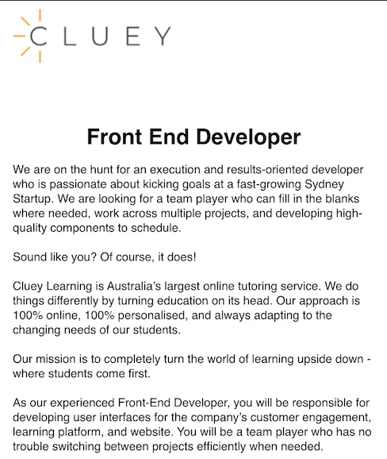
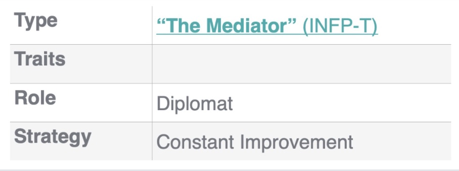
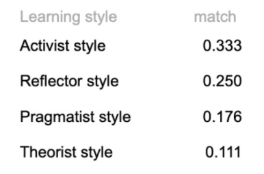

<html>

<h1>Personal Information</h1>
Henry Robinson    
Email: s3872400@student.rmit.edu.au  
Nationality: Australian  
Education: Bachelor of Music Performance  
Languages spoken: English    
<h1>Interest in IT</h1>

After spending the last 10 years as a working musician, I made the decision to begin a new chapter in my professional life. This stemmed from a longtime interest in the field, and also a desire for a career that provides more stability yet is mentally stimulating. I enjoy work that involves a constant evolution and problem solving.  

Beginning as a child growing up in the 90s, I became fascinated with IT and its integration into society. I was impressed with how quickly technology was improving, and I developed a strong desire to understand the systems behind them. This evolved into a fascination with  the socio-economic consequences of an increasingly connected world. In my career as a musician I have had to incorporate IT into my set up more and more. Some tours have required extensive Audio/MIDI set ups that expanded my problem solving knowledge. This included running entire bands with linked in-ear monitors, syncing a light show to be automated to a bands performance, among other things. This re ignited a desire to deepen my knowledge and develop my IT skillset.  
RMIT became my place of choice to study because of its history as a reputable institute. Several of my friends and former colleagues have completed degrees at RMIT and all highly recommended it to me. The online option of the degree was also a high selling point, as I am able to fit IT study around my other commitments. I have also been very fascinated with new innovations coming from RMIT.  

During my time at UNI I hope to gain a strong understanding of some common programming languages, with a particular focus on front end development for apps and websites. I am also interested in Network and Systems administration, I hope to develop deeper knowledge running and maintaining servers. On a personal level, I’m interested in the the social and ethical impacts of a technology based world. 

<h1>Ideal Job</h1>
<a href="https://www.seek.com.au/job/50560719?type=standout#searchRequestToken=a5b70448-191b-4c72-8556-594bd8955429">Front End Developer</a>  
    
<i>What makes this job appealing to me?</i>   

This advertisement from Cluey Learning stood out to me as an ideal job. It is a team based role with a focus on developing visual interfaces for their online tutoring app and website. The goal of a job like this would to make an interface that is equally engaging and visually appealing for the user. 
  
<i>What qualifications and experience required for the position?</i>.  

To attain a job like this, I would need competency in several languages (including JavaScript and CSS and their library tools (redux, bootstrap etc). I would also need at least 2 years experience in software development, ideally working in Agile environments. This would include experience with Atlassian tools used in Agile environments, like Jira and Trello (https://www.atlassian.com/). I would also need particular experience in building user interfaces which leverage APIs. 

The role also prefers someone who has a history in education, whether it be in education software or another capacity. A bachelor in computer science/engineering is preferred, but equivalent experience is accepted. 

In terms of personal characteristics, the role calls for someone who can work well in a team, as the role places a strong emphasis on collaboration and communication. 
  

<i>What qualifications and experience I currently have?</i>  

Having spent the last 10 years as a musician has at many times involved tutoring students in a school and private environment. I first started teaching  regularly when I finished my BS Music Performance in 2013, and have come back to it several times. This included preparing students for exams, VCE and concerts. I believe my skills in this area at least give me a head start in terms of being able to collaborate in an educational mindset. 
  
<i>Plan to obtain the skills:</i>  

Attaining a job like this will involve a lot of groundwork on my end. Over the next few years I am aiming to complete a bachelor of IT, though I may have to consider (and am open to) making my degree more specialist for a role like this. I have not had any experience with coding, apart from in high school and it is one of my goals to become highly proficient in JavaScript, HTML and CSS over the next few years. This would also involve getting familiar with various script libraries and tools for each language. 

I will likely have to collaborate on some relevant independent projects either during or after my studies. This will help me in establishing more of a resume for myself. I will in particular be looking for projects that operate in an Agile environment, so that I can get that relevant experience for jobs such as the one above. I will also be looking for roles from larger firms that require little to no experience. 

  
<h1>Profile</h1> 
  

According to the results of a <a href="https://www.16personalities.com">Myers-Briggs test</a>, I have a Mediator type personality (INFP-T). According to 16 Personalities, a Mediator is defined as a diplomat who values constant improvement. An idealist who tries to see the best in things, mediator is able to work well in a team with their communication skills and philosophical thinking.
  
    
The <a href="http://www.emtrain.eu/learning-styles/">My Learning Style test</a> indicated that my primary learning style is Activist. Pragmatic and team based approaches to problem solving are strong in this category, with preferred learning methods like brainstorming, problem setting and group discussions. According to this test I am also associated with the reflector, pragmatist and theorist styles of learning. 

   <a href="https://drive.google.com/file/d/1YRv7rS_6WxZ5t5iXsjIgaQbZ20_u3mpM/view?usp=sharing">Leadership Style Quiz Results</a>  
Finally, a <a href="https://eml.usc.edu/leadership-style-quiz">Leadership quiz</a> indicated that I have a Frontline leadership style. In short, this leadership style involves team member empowerment and uniting them under a shared vision with effective verbal communication.
  
<i>What do the results of these tests mean for you? </i>    
I think these tests are reasonably in line with traits I see in myself personally, especially in regards to how I best learn. 

 
<i>How do you think these results may influence your behaviour in a team?</i>  
Looking back on personal experiences I definitely see examples of these results manifesting in previous team situations. I am someone in a team who can help others explore their ideas, and communicate them with team members who may think differently. I may also contribute outside of the box ideas that will be a valued in brainstorming and group discussions. 
  
<i>ow should you take this into account when forming a team? </i>    
I think that empowerment is a very effective tool in a team, because it can foster an environment of positivity and motivation. I believe that if you try see the best in people, they are more likely to give you their best. When forming a team I also see a parallel in emphasising group discussions and brainstorming, as this allows for all ideas to get out on the table. The better your team functions, the more you can keep individual egos at bay and get good results. 

<h1><u>Project Idea: FilmScore</u></h1>  

FilmScore is an idea for a subscription based, locally installed plug-in, linking video footage with a secure library of both royalty free and rights-managed music. The idea behind FilmScore it is to link filmmakers and large music publishers together inside the users video editing software, minimising both bandwidth usage and privacy concerns. By offering both an in house and premium library, FilmScore would be able to accomodate productions of all sizes; from small independent filmmakers, all the way up to large production companies.  

With millions of film creators all over the world (Ask Wonder, 2017) there is a growing need for libraries of music content. There are many options that exist today such as Splice (Constine, 2018), Epidemics Sounds (Lunden, 2020) and FILMSTRO (Monlux, 2017); however none of these offer an all in one solution that offers an in house library and also links large publishers to filmmakers in one easy place. Users would be able to load the plug-in into their video editing software, and then test out different songs based on their search criteria.   

The idea would have two seperate libraries, one for royalty free which comes inclusive with the monthly subscription, and another which artists and publishers can have registered profiles of their work. If for example, Warner Chappell publishing (of Kendrick Lamar and Eric Clapton fame [Warner Chappell, 2020] ) were registered as FilmScore publishers, their profiles would list their available songs and their estimated cost. After previewing how the song sounds over their work, a user would request to purchase the rights to the song, which may initiate an email chain (in the users local email) between the user and the publisher. Some smaller publishers and composers, may not require this and instead a user would be directed to a checkout.  

FilmScore would run as a plugin with-in the video editing software, in a similar fashion to Twixtor or Boris FX Graffiti (Dudley, 2018). A user can open it without having to export any video from their session into an external program. The plug-in will have its own window and interface that opens up within the video editing software.   

Searching in the app is in line with other music library apps and websites (Splice, 2020). A user would search with a range of tags which could be moods, feels, instrumentation. An example of this might be “Happy, Jazz, Trumpet” and all audio that has the relevant tags will appear in the results. A user could also search for a specific artist by typing their name. Also present in the search area is a customisable toggles, sliders and dropdown that allow the user to input a genre, tempo, tonality and key. Finally, a set of radio buttons that allow the user to select from the royalty free library, the rights managed library or both. The specificity in the search may have a slight learning curve to it, but with practice this should be as easy to manage as browser based audio libraries.   

After a user has selected an audio file, with the timecode selected in their video editing software, they are able to run the audio in sync with the video timecode. There would also be an option to create a playlist within the plug-in , which means several options could be quickly tested at the same time. For example, if someone was looking for an ominous soundtrack, they could save 10 songs to a playlist with the tags and then try each one quickly over the scene. FilmScore would have a native audio reel within the software, so dragging the audio without moving the video will be easy to do. Once audio has been finalised, the user can press “lock audio” which will save the session with the relevant time codes and pieces. A user can then move on to the next timecode in their video session, and add a new piece of music from the search.   

Film-score would also accept most audio file types from the local computer. This to to ensure that there is no navigating between two different locations within the video editing software for audio files. This ease of access means that FilmScore can operate as a users main interface for finalising the soundtrack to any video project.   

To use FilmScore, the user would have a computer running either Windows 10 or OSX, and be running Adobe Premier Pro or Final Cut Pro. The plug in would use the extension native to the interface of the video editing software (Rouse, 2010). For example, the Windows 10 version of Adobe Premier version would be installed into the plug in folder native to C:\Program Files\Adobe\Common\Plug-Ins\CS6\MediaCore\ as a .PRM file (Toolfarm, 2014) . Premier is able to manually scan and locate  plug-ins within the media core folder (Waves, 2020)   

To get FilmScore up and running, a server would need to be hired from a company like ServerMania (Glyzko, 2020) and/or hosting data on a cloud (Google, 2020) in a manner similar to Spotify (Toor, 2016). The size of the library would be limited by the amount of capital raised, but the hope would be to host at least 2.5tb of content upon release. According to the results of an online audio file size calculator(Crawley, 2020), 2tb equates to about 2000 hours of audio. The remaining 500gb would leave room to expand the library, and also potentially host other client data.   

If the project was successful, then the plug-in would have created an easy way to connect filmmakers of all levels with professional publishers almost entirely within the confines of their Video Editing Software. This would provide a useful tool for many filmmakers who may not be aware of the processes involved in licensing and publishing. Keeping things inside a creative interface is becoming a crucial element of development in this area. As such, software ideas like this that can solve problems without having to disrupt workflow of the user.   

References:   

Kat V and Cara R 2017,<i> How many professional filmmakers are there globally? And how many by each major region?</i>, Ask Wonder 23 August, viewed September 19 2020 <https://askwonder.com/research/professional-filmmakers-globally-major-region-w6qs3lel4>  

Constine, Josh 2018,<i> Instead of Stealing Instruments, Musicians Turn to Splice</i>, Tech Crunch, 16 April, viewed 19 September 2020, <https://techcrunch.com/2018/04/16/splice-sounds/ >  

Lunden, I 2019, <i>Epidemic Sound raises $20M at a $370M valuation for its soundtrack music discovery and licensing platform</i>, Tech Crunch, 01 July, viewed 19 September, 2020 < https://tcrn.ch/2Jkowsx>  

Monlux, C 2017,<i> Filmstro Pro Offers Unique Control Over Your Videos Soundtrack</i>, Video Maker, 07 July, viewed September 19, 2020, <https://www.videomaker.com/article/r01/19106-review-filmstro-pro-offers-unique-control-over-your-videos-soundtrack>  

Warner Chappell, <i>Our Artists</i>, Warner Chappell, n.d., viewed 19 September 2020, <https://www.warnerchappell.com/our-artists>  

Dudley, D 2018, <i> 7 Essential Adobe Premiere Pro Plugins</i>, Flaunt Digital, 10 July, viewed September 19 2020 <https://flauntdigital.com/blog/7-essential-adobe-premiere-pro-plugins/>  

Splice, <i>Finding Sounds</i>, Splice n.d, viewed September 19, 2020 <https://support.splice.com/hc/en-us/articles/360015511193-Finding-Sounds >  

Rouse 2010, M <i>PRM File Format</i>, Tech Target, 01 September, viewed September 19, 2020 < https://whatis.techtarget.com/fileformat/PRM-Adobe-Premiere-plug-in-file>  

Toolfarm 2014,<i> In Depth: Plug-ins Adobe After Effects CC and Premier PRO CC</i>, Toolfarm 04/02, viewed September 19, 2020 <https://www.toolfarm.com/tutorial/in_depth_plug_ins_adobe_after_effects_cc_and_premiere_pro_cc/>  
Waves 2020, <i>How to Find Your Plugins in Adobe Audition or Premier</i>, Waves 05/07, viewed 19 September 2020 <https://www.waves.com/support/how-to-find-your-plugins-in-adobe-audition>  

Glyzko, N 2020, <i>How Much Does it Cost to Rent a Server? </i>Server Mania 24/06, viewed 19 September 2020< https://www.servermania.com/kb/articles/how-much-does-it-cost-to-rent-a-server/>  
Google, n.d., <i>Price List</i>, Google, viewed 19 Sept 2020,   <https://cloud.google.com/pricing/list >  

Toor, A 2016, <i>Spotify is Moving its Data to Google’s Servers</i>, The Verge 24/02, viewed September 19 2020,  <https://www.theverge.com/2016/2/24/11104446/spotify-google-cloud-platform>  

Crawley, C <i>Audio File Size Calculator</i>, Colin Crawley, n.d, viewed 19 September 2020,  <https://www.colincrawley.com/audio-file-size-calculator/>  

